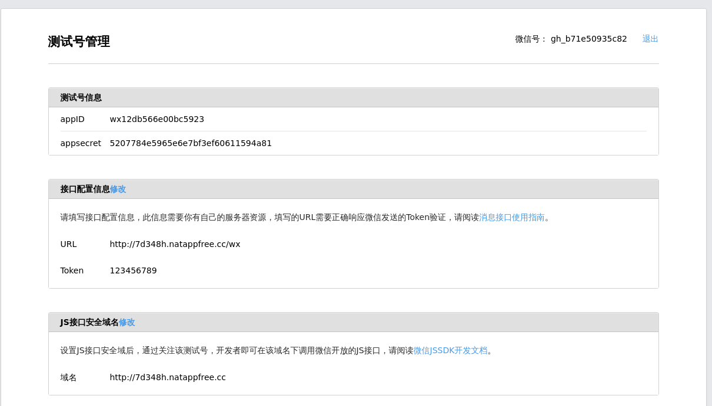

### Wechat Dev

Build [Wechat Official Account](https://mp.weixin.qq.com) Development Enviroment With Rails

#### Start Our Server

1\. Start Nginx

Wechat Server transmits data with your server start in 80 port

configure nginx

```
server {
    listen 80;

    server_name git.com;

    location / {
      proxy_pass http://127.0.0.1:3000;
      client_max_body_size   1000m;
    }
    error_page 500 502 503 504 /50x.html;

    location = /50x.html {
        root html;
    }
}
```


2\. Start Rails Server

bundle install

setup [Eric-Guo/wechat](https://github.com/Eric-Guo/wechat)

rails s

3\. Start Natapp

[Natapp](https://natapp.cn/) is NAT traversal tool for supporting public ip.

download [Natapp client](https://natapp.cn/#download)

usage [Natapp client](https://natapp.cn/article/nohup)

#### Apply for Wechat Debug Account

1. Link [Wechat Debug Account](https://mp.weixin.qq.com/debug/cgi-bin/sandbox?t=sandbox/login)

2. Fill in these following configuare



#### Issues

1. [测试公众服务号 添加接口配置信息失败](https://github.com/Eric-Guo/wechat/issues/185)

#### Thanks

[Eric-Guo/wechat](https://github.com/Eric-Guo/wechat)